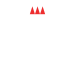

    
    <h1>KW1C Studiekeuzetest - Project Thema 3</h1>
    
A small website builded for student at Koning Willem I College (not for use purposes) where students can do a studyselftest

    <a href="https://projectthema3.azurewebsites.net/">View Demo</a>
    ·
    <a href="https://github.com/Markiesch/ProjectThema3/issues">Report Bug</a>
    ·
    <a href="https://github.com/Markiesch/ProjectThema3/issues">Request Feature</a>

 
 
 

